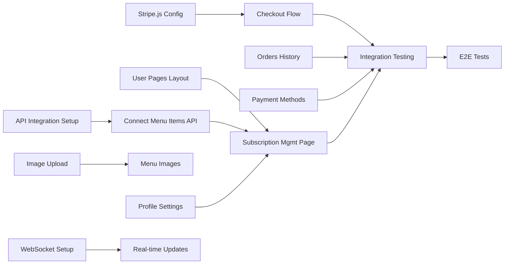

# Phase 4 Completion Plan - Sub-Agent Workflow System
**Osassy's Kitchen - Outstanding Tasks Implementation**

## Executive Summary
This document outlines the parallel execution strategy for completing the remaining 15% of Phase 4, decomposed into atomic, PR-ready chunks that can be developed simultaneously by specialized sub-agents.

## ⚠️ CRITICAL REQUIREMENT: Testing Gates
**Every wave MUST complete comprehensive testing with 80% minimum code coverage before proceeding to the next wave.** This includes:
- Writing Jest test suites for all components
- Achieving 80%+ code coverage
- Running and passing all tests
- Documenting test results
- Use the PlayWright MCP to test UI flows if need be and use captured screenshots to compare expected behavior.
- Getting explicit approval before continuing

This requirement ensures quality, prevents regression, and maintains code reliability throughout the implementation.

---

## 1. Task Decomposition & Dependency Matrix

### Phase 4 Outstanding Tasks Matrix

| Phase | Column A (Independent) | Column B (Depends on A) | Column C (Independent) | Column D (Depends on B/C) |
|-------|------------------------|-------------------------|------------------------|---------------------------|
| **4.1** | API Integration Setup | Connect Menu Items API | Create User Pages Layout | - |
| **4.2** | Stripe.js Configuration | Checkout Flow Implementation | Orders History Component | - |
| **4.3** | Image Upload Service | Menu Image Integration | Profile Settings Form | Subscription Management Page |
| **4.4** | WebSocket Setup | Real-time Order Updates | Payment Methods UI | Full Integration Testing |
| **4.5** | - | - | Visual Refinements | E2E Test Suite |

### Dependency Visualization


---

## 2. PR Chunking Strategy

### Chunk Definitions

#### Chunk-001: API Integration Foundation
```yaml
type: Foundation
phase: 4.1
size: ~150 lines
dependencies: none
files:
  - lib/api-client.ts
  - lib/api-types.ts
  - hooks/useApi.ts
acceptance_criteria:
  - Generic API client with error handling
  - TypeScript types for all API responses
  - React Query setup for data fetching
review_time: 15 minutes
agent: api-endpoint-builder
```

#### Chunk-002: Menu Items API Connection
```yaml
type: Feature
phase: 4.1
size: ~200 lines
dependencies: [chunk-001]
files:
  - pages/subscriptions/create.tsx (modify)
  - hooks/useMenuItems.ts (new)
  - components/MenuItemSkeleton.tsx (new)
acceptance_criteria:
  - Real menu items displayed
  - Loading states implemented
  - Error handling with retry
review_time: 20 minutes
agent: api-endpoint-builder
```

#### Chunk-003: Stripe.js Integration
```yaml
type: Foundation
phase: 4.2
size: ~180 lines
dependencies: none
files:
  - lib/stripe-client.ts
  - components/StripeProvider.tsx
  - hooks/useStripe.ts
acceptance_criteria:
  - Stripe.js loaded dynamically
  - Provider wraps app
  - Publishable key configured
review_time: 15 minutes
agent: stripe-integration-specialist
```

#### Chunk-004: Checkout Flow Implementation
```yaml
type: Integration
phase: 4.2
size: ~300 lines
dependencies: [chunk-002, chunk-003]
files:
  - pages/subscriptions/create.tsx (modify)
  - pages/api/subscribe.ts (modify)
  - pages/success.tsx (new)
  - pages/cancel.tsx (new)
acceptance_criteria:
  - Checkout session creation works
  - Redirect to Stripe Checkout
  - Success/cancel pages functional
  - Webhook creates subscription
review_time: 25 minutes
agent: stripe-integration-specialist
```

#### Chunk-005: User Pages Layout
```yaml
type: Foundation
phase: 4.1
size: ~250 lines
dependencies: none
files:
  - components/user/UserLayout.tsx
  - components/user/UserSidebar.tsx
  - components/user/UserHeader.tsx
  - styles/user-layout.module.scss
acceptance_criteria:
  - Consistent layout across user pages
  - Mobile responsive sidebar
  - Active page highlighting
review_time: 20 minutes
agent: scss-styling-expert
```

#### Chunk-006: Orders History Page
```yaml
type: Feature
phase: 4.2
size: ~350 lines
dependencies: [chunk-001, chunk-005]
files:
  - pages/user/orders.tsx
  - components/user/OrderList.tsx
  - components/user/OrderCard.tsx
  - hooks/useOrders.ts
acceptance_criteria:
  - Paginated order list
  - Filter by status/date
  - Order detail modal
  - Invoice download
review_time: 25 minutes
agent: react-frontend-expert
```

#### Chunk-007: Profile Settings Page
```yaml
type: Feature
phase: 4.3
size: ~280 lines
dependencies: [chunk-005]
files:
  - pages/user/profile.tsx
  - components/user/ProfileForm.tsx
  - components/user/AddressManager.tsx
  - components/user/NotificationPreferences.tsx
acceptance_criteria:
  - Update personal info
  - Manage delivery addresses
  - Notification preferences
  - Form validation
review_time: 20 minutes
agent: react-frontend-expert
```

#### Chunk-008: Payment Methods Management
```yaml
type: Feature
phase: 4.4
size: ~320 lines
dependencies: [chunk-003, chunk-005]
files:
  - pages/user/payments.tsx
  - components/user/PaymentMethodList.tsx
  - components/user/AddPaymentMethod.tsx
  - hooks/usePaymentMethods.ts
acceptance_criteria:
  - List saved payment methods
  - Add new payment method
  - Set default method
  - Remove payment method
review_time: 25 minutes
agent: stripe-integration-specialist
```

#### Chunk-009: Subscription Management Page
```yaml
type: Integration
phase: 4.3
size: ~400 lines
dependencies: [chunk-002, chunk-004, chunk-005]
files:
  - pages/user/subscriptions/[id].tsx
  - components/user/SubscriptionDetails.tsx
  - components/user/SubscriptionEditor.tsx
  - hooks/useSubscription.ts
acceptance_criteria:
  - View subscription details
  - Edit subscription items
  - Pause/resume functionality
  - Cancel subscription
review_time: 30 minutes
agent: react-frontend-expert
```

#### Chunk-010: Image Upload Service
```yaml
type: Foundation
phase: 4.3
size: ~200 lines
dependencies: none
files:
  - lib/cloudinary.ts
  - api/upload.ts
  - hooks/useImageUpload.ts
  - components/ImageUploader.tsx
acceptance_criteria:
  - Cloudinary integration
  - Image optimization
  - Progress tracking
  - Error handling
review_time: 20 minutes
agent: api-endpoint-builder
```

#### Chunk-011: Menu Image Integration
```yaml
type: Feature
phase: 4.3
size: ~150 lines
dependencies: [chunk-010]
files:
  - pages/admin/menu.tsx (modify)
  - components/admin/MenuItemCard.tsx (modify)
acceptance_criteria:
  - Upload images for menu items
  - Display uploaded images
  - Image preview before upload
review_time: 15 minutes
agent: react-frontend-expert
```

#### Chunk-012: WebSocket Infrastructure
```yaml
type: Foundation
phase: 4.4
size: ~250 lines
dependencies: none
files:
  - lib/websocket.ts
  - pages/api/socket.ts
  - hooks/useWebSocket.ts
  - components/providers/WebSocketProvider.tsx
acceptance_criteria:
  - WebSocket server setup
  - Client connection management
  - Reconnection logic
  - Event handling
review_time: 20 minutes
agent: api-endpoint-builder
```

#### Chunk-013: Real-time Updates
```yaml
type: Feature
phase: 4.4
size: ~200 lines
dependencies: [chunk-012]
files:
  - components/user/OrderTracker.tsx
  - components/admin/LiveDashboard.tsx
  - hooks/useRealTimeData.ts
acceptance_criteria:
  - Live order status updates
  - Real-time dashboard metrics
  - Notification system
review_time: 20 minutes
agent: dashboard-analytics-specialist
```

#### Chunk-014: Visual Refinements
```yaml
type: Enhancement
phase: 4.5
size: ~300 lines
dependencies: none
files:
  - styles/components/*.scss (modify)
  - components/ui/* (modify)
acceptance_criteria:
  - Pixel-perfect alignment
  - Consistent spacing
  - Animation polish
  - Mobile optimization
review_time: 25 minutes
agent: scss-styling-expert
```

#### Chunk-015: E2E Test Suite
```yaml
type: Testing
phase: 4.5
size: ~500 lines
dependencies: [chunk-004, chunk-009]
files:
  - cypress/e2e/subscription-flow.cy.ts
  - cypress/e2e/user-dashboard.cy.ts
  - cypress/e2e/admin-management.cy.ts
  - cypress/support/commands.ts
acceptance_criteria:
  - Complete subscription flow test
  - User journey tests
  - Admin workflow tests
  - Payment flow validation
review_time: 30 minutes
agent: testing-automation-engineer
```

---

## 3. Sub-Agent Assignment & Parallel Execution Plan

### Agent Allocation

| Agent | Assigned Chunks | Estimated Hours | Priority |
|-------|----------------|-----------------|----------|
| **api-endpoint-builder** | 001, 002, 010, 012 | 16 hours | HIGH |
| **stripe-integration-specialist** | 003, 004, 008 | 14 hours | CRITICAL |
| **react-frontend-expert** | 006, 007, 009, 011 | 18 hours | HIGH |
| **scss-styling-expert** | 005, 014 | 10 hours | MEDIUM |
| **dashboard-analytics-specialist** | 013 | 4 hours | LOW |
| **testing-automation-engineer** | 015 | 8 hours | MEDIUM |

### Parallel Execution Timeline with Testing Gates

```
WAVE 1 - Foundation (Day 1-2):
├── api-endpoint-builder: Chunk-001 (3h)
├── stripe-integration-specialist: Chunk-003 (3h)
├── scss-styling-expert: Chunk-005 (4h)
└── testing-automation-engineer: Setup test infrastructure

🧪 WAVE 1 TESTING GATE (Day 2):
├── Write Jest tests for all Wave 1 components
├── Achieve minimum 80% code coverage
├── Run integration tests
├── Fix any failing tests
└── Get approval before proceeding to Wave 2

WAVE 2 - Dependencies (Day 3-4):
├── api-endpoint-builder: Chunk-002 (4h)
├── stripe-integration-specialist: Chunk-004 (6h)
├── react-frontend-expert: Chunk-006 (5h)
└── scss-styling-expert: Continue refinements

🧪 WAVE 2 TESTING GATE (Day 4):
├── Write tests for new components
├── Maintain 80% coverage threshold
├── Verify integration with Wave 1
└── Get approval before proceeding

WAVE 3 - Features (Day 5-6): ✅ COMPLETE
├── react-frontend-expert: Chunk-007 (4h), Chunk-009 (6h)
├── api-endpoint-builder: Chunk-010 (4h)
├── stripe-integration-specialist: Chunk-008 (5h)
└── testing-automation-engineer: Update test suites

🧪 WAVE 3 TESTING GATE (Day 6): ✅ COMPLETE
├── Test all new features
├── Update integration tests
├── Coverage report review
└── Get approval before proceeding

🧹 HOUSEKEEPING PHASE (Day 7) - PRIORITY:
├── Fix all failing tests (112 currently failing)
├── Fix router mock setup issues
├── Update mock data to match interfaces
├── Fix multiple element queries with *AllBy variants
├── Improve test coverage from 43% to 80% minimum
├── Fix ESLint warnings and code quality issues
├── Ensure TypeScript compilation remains clean
└── Run full test suite with all tests passing

WAVE 4 - Integration (Day 8-9):
├── api-endpoint-builder: Chunk-012 (4h)
├── react-frontend-expert: Chunk-011 (3h)
├── dashboard-analytics-specialist: Chunk-013 (4h)
└── scss-styling-expert: Chunk-014 (6h)

🧪 WAVE 4 TESTING GATE (Day 8):
├── Comprehensive integration testing
├── End-to-end test scenarios
├── Performance testing
└── Get approval before final phase

WAVE 5 - Final Testing & Polish (Day 9):
├── testing-automation-engineer: Complete E2E tests (Chunk-015)
├── All agents: Bug fixes from test results
├── Final coverage report (target: 85%+)
└── Production readiness verification
```

---

## 4. Testing Requirements Per Wave

### 🧪 Wave Testing Protocol

**MANDATORY: Each wave must complete testing before proceeding to the next wave.**

#### Wave Testing Checklist:
```yaml
wave_testing_requirements:
  before_next_wave:
    - Jest test suites: Written for all new components
    - Code coverage: Minimum 80% per component
    - Integration tests: Cross-component functionality verified
    - Test execution: All tests passing (npm test)
    - Coverage report: Generated and reviewed
    - Documentation: Test files and results documented
    - Approval: Explicit user sign-off required

  test_deliverables:
    - Test files in src/__tests__/
    - Coverage report (npm test -- --coverage)
    - Test summary document
    - Any failing tests fixed
    - Mock data and utilities created

  coverage_targets:
    - Statements: 80%+
    - Branches: 80%+
    - Functions: 80%+
    - Lines: 80%+
```

#### Testing Commands:
```bash
# Run all tests
npm test

# Run with coverage
npm test -- --coverage

# Run specific test file
npm test -- [filename]

# Watch mode for development
npm test -- --watch

# Generate coverage report
npm test -- --coverage --coverageReporters=html
```

---

## 5. Quality Control Checklist

### Pre-PR Requirements for Each Chunk

```yaml
mandatory_checks:
  code_quality:
    - TypeScript compilation: PASS
    - ESLint: 0 errors, 0 warnings
    - Prettier: Formatted
    - No console.log statements
    - No commented code
  
  testing:
    - Unit tests: Written and passing
    - Coverage: Minimum 80%
    - Integration tests: Where applicable
    - Manual testing: Documented
    - Test results: Saved in testing/ folder
  
  documentation:
    - JSDoc comments: All public functions
    - README updates: If needed
    - Acceptance criteria: Met
    - Test documentation: Created
  
  performance:
    - Bundle size: Within limits
    - Lighthouse score: >90
    - No memory leaks
    - Tests run in < 30 seconds
```

---

## 5. Chunk Manifest Template

### Example: chunk-004-manifest.json
```json
{
  "chunk_id": "chunk-004",
  "title": "Stripe Checkout Flow Implementation",
  "type": "integration",
  "phase": "4.2",
  "agent": "stripe-integration-specialist",
  "dependencies": ["chunk-002", "chunk-003"],
  "blocked_by": [],
  "blocks": ["chunk-009"],
  
  "description": "Implements the complete Stripe checkout flow including session creation, redirect handling, and success/cancel pages",
  
  "acceptance_criteria": [
    "✅ Cart items sent to /api/subscribe endpoint",
    "✅ Stripe checkout session created with correct line items",
    "✅ User redirected to Stripe hosted checkout",
    "✅ Success page shows order confirmation",
    "✅ Cancel page allows retry",
    "✅ Webhook creates subscription in database"
  ],
  
  "files": {
    "modified": [
      "pages/subscriptions/create.tsx",
      "pages/api/subscribe.ts"
    ],
    "created": [
      "pages/success.tsx",
      "pages/cancel.tsx",
      "components/OrderConfirmation.tsx"
    ],
    "deleted": []
  },
  
  "tests": {
    "unit": [
      "__tests__/api/subscribe.test.ts",
      "__tests__/pages/success.test.tsx"
    ],
    "integration": [
      "__tests__/integration/checkout-flow.test.ts"
    ],
    "e2e": [
      "cypress/e2e/checkout.cy.ts"
    ],
    "coverage": {
      "statements": 85,
      "branches": 80,
      "functions": 90,
      "lines": 85
    }
  },
  
  "metrics": {
    "estimated_hours": 6,
    "actual_hours": null,
    "lines_added": 250,
    "lines_removed": 50,
    "complexity": "medium",
    "review_time_minutes": 25
  },
  
  "risks": [
    "Stripe API changes",
    "Webhook signature validation",
    "Session timeout handling"
  ],
  
  "rollback_plan": "Revert to mock checkout flow, disable Stripe integration flag"
}
```

---

## 6. Communication Protocol

### Agent Status Updates

```typescript
interface AgentStatus {
  agent_id: string;
  agent_type: string;
  current_chunk: string;
  status: 'idle' | 'working' | 'blocked' | 'review' | 'complete';
  progress: number; // 0-100
  started_at: string;
  estimated_completion: string;
  blockers: string[];
  output_files: string[];
  metrics: {
    lines_written: number;
    tests_written: number;
    coverage: number;
  };
}

// Example status update
{
  "agent_id": "stripe-specialist-001",
  "agent_type": "stripe-integration-specialist",
  "current_chunk": "chunk-004",
  "status": "working",
  "progress": 65,
  "started_at": "2024-01-10T10:00:00Z",
  "estimated_completion": "2024-01-10T16:00:00Z",
  "blockers": [],
  "output_files": [
    "pages/success.tsx",
    "pages/cancel.tsx"
  ],
  "metrics": {
    "lines_written": 165,
    "tests_written": 4,
    "coverage": 82
  }
}
```

---

## 7. Risk Mitigation Strategy

### Identified Risks & Mitigation

| Risk | Probability | Impact | Mitigation |
|------|------------|--------|------------|
| Stripe API breaking changes | Low | High | Version lock, comprehensive tests |
| Database migration issues | Medium | High | Backup before migration, rollback plan |
| WebSocket connection failures | Medium | Medium | Fallback to polling, retry logic |
| Image upload service limits | Low | Low | Rate limiting, queue system |
| Merge conflicts | Medium | Medium | Small PRs, frequent rebasing |
| Test flakiness | High | Low | Retry logic, better test isolation |

---

## 8. Success Metrics

### Completion Criteria

```yaml
phase_4_complete_when:
  functional:
    - All user pages accessible and functional
    - Subscription creation flow works end-to-end
    - Payment processing successful
    - Real-time updates working
    - Image uploads functional
  
  quality:
    - Test coverage > 80%
    - All Lighthouse scores > 90
    - Zero critical bugs
    - Zero security vulnerabilities
  
  performance:
    - Page load < 2 seconds
    - API response < 200ms
    - WebSocket latency < 100ms
    - Bundle size < 500KB
```

---

## 9. Rollback Procedures

### Per-Chunk Rollback Strategy

```bash
# Automated rollback script
#!/bin/bash

CHUNK_ID=$1
COMMIT_HASH=$(git log --grep="chunk-${CHUNK_ID}" --format="%H" -n 1)

if [ -z "$COMMIT_HASH" ]; then
  echo "Chunk ${CHUNK_ID} not found"
  exit 1
fi

# Create revert branch
git checkout -b revert-chunk-${CHUNK_ID}

# Revert the chunk
git revert $COMMIT_HASH --no-edit

# Run tests
npm test

# If tests pass, create PR
if [ $? -eq 0 ]; then
  gh pr create --title "Revert chunk-${CHUNK_ID}" \
    --body "Automated rollback of chunk-${CHUNK_ID} due to issues"
else
  echo "Tests failed after revert, manual intervention required"
  exit 1
fi
```

---

## 10. Daily Standup Format

### Morning Sync (9:00 AM)
```markdown
## Daily Standup - [Date]

### Completed Yesterday
- [Agent 1]: Chunk-XXX merged, PR #123
- [Agent 2]: Chunk-YYY in review
- [Agent 3]: Blocked on Chunk-ZZZ

### Today's Plan
- [Agent 1]: Starting Chunk-AAA (4 hours)
- [Agent 2]: Addressing PR feedback
- [Agent 3]: Unblocking dependency

### Blockers
- Need Stripe test keys
- Waiting for design approval
- Database migration pending

### Metrics
- Chunks completed: 8/15
- Test coverage: 82%
- Days remaining: 5
```

---

## 11. Implementation Checklist

### Pre-Development
- [ ] All agents configured and ready
- [ ] Development environment set up
- [ ] Stripe test account created
- [ ] Cloudinary account configured
- [ ] Database backup created
- [ ] CI/CD pipeline ready

### During Development
- [ ] Daily standups conducted
- [ ] PRs created within size limits
- [ ] Code reviews completed < 30 mins
- [ ] Tests written alongside code
- [ ] Documentation updated

### Post-Development
- [ ] All acceptance criteria met
- [ ] E2E tests passing
- [ ] Performance benchmarks met
- [ ] Security scan clean
- [ ] Deployment plan ready
- [ ] Rollback procedures tested

---

## 12. Expected Outcomes

### By End of Implementation
- **15 PR-ready chunks** merged
- **~3,500 lines** of production code
- **~1,500 lines** of test code
- **85%+ test coverage**
- **All Phase 4 tasks complete**
- **Ready for Phase 5 launch**

### Timeline
- **Start Date**: Immediate
- **End Date**: 9 working days
- **Buffer**: 2 days for integration testing
- **Total Duration**: 11 days

---

## Appendix A: File Structure After Completion

```
src/
├── pages/
│   ├── user/
│   │   ├── dashboard.tsx ✅
│   │   ├── orders.tsx 🆕
│   │   ├── profile.tsx 🆕
│   │   ├── payments.tsx 🆕
│   │   └── subscriptions/
│   │       ├── index.tsx ✅
│   │       ├── create.tsx ✅ (modified)
│   │       └── [id].tsx 🆕
│   ├── success.tsx 🆕
│   └── cancel.tsx 🆕
├── components/
│   ├── user/
│   │   ├── UserLayout.tsx 🆕
│   │   ├── OrderList.tsx 🆕
│   │   ├── ProfileForm.tsx 🆕
│   │   ├── PaymentMethodList.tsx 🆕
│   │   └── SubscriptionEditor.tsx 🆕
│   └── providers/
│       ├── StripeProvider.tsx 🆕
│       └── WebSocketProvider.tsx 🆕
├── lib/
│   ├── api-client.ts 🆕
│   ├── stripe-client.ts 🆕
│   ├── cloudinary.ts 🆕
│   └── websocket.ts 🆕
└── hooks/
    ├── useApi.ts 🆕
    ├── useStripe.ts 🆕
    ├── useOrders.ts 🆕
    ├── useImageUpload.ts 🆕
    └── useWebSocket.ts 🆕
```

---

## Appendix B: Agent Command Reference

```bash
# Initialize phase 4 completion
coordinator init --plan phase-4-completion-plan.md

# Spawn agents for parallel work
coordinator spawn-agents --phase 4.1 --parallel 3

# Monitor progress
coordinator status --dashboard

# Check chunk dependencies
coordinator check-deps --chunk chunk-004

# Run quality checks
coordinator qc --chunk chunk-004

# Create PR
coordinator create-pr --chunk chunk-004 --auto-assign

# Merge chunk
coordinator merge --chunk chunk-004 --squash

# Rollback if needed
coordinator rollback --chunk chunk-004

# Generate report
coordinator report --phase 4 --format markdown
```

---

**Document Version**: 1.0  
**Created**: January 2025  
**Status**: Ready for Implementation  
**Next Review**: After Phase 4.1 completion